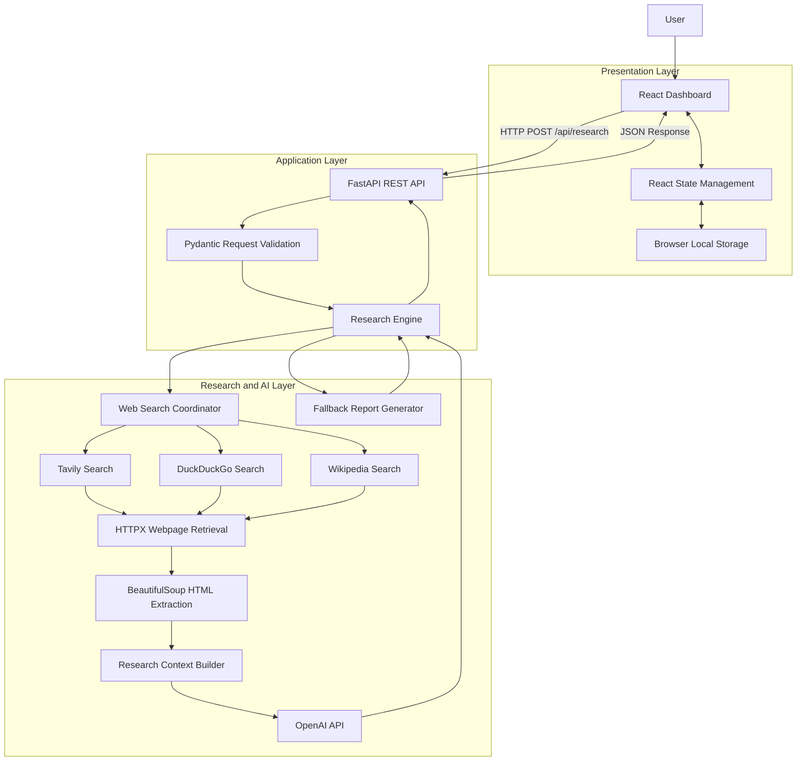

# Meridian — AI Research Agent

An AI-powered web research application that searches the internet, retrieves relevant webpages, processes their content, and generates structured research reports with source citations using a Large Language Model (LLM).

Meridian combines a React-based frontend, a Python FastAPI backend, web search providers, webpage extraction tools, and the OpenAI API to create an integrated research experience.

---

## Table of Contents

- [Project Overview](#project-overview)
- [Key Features](#key-features)
- [System Architecture](#system-architecture)
- [Architecture Overview](#architecture-overview)
- [Technology Stack](#technology-stack)
- [Project Structure](#project-structure)
- [How Meridian Works](#how-meridian-works)
- [Backend Architecture](#backend-architecture)
- [Frontend Architecture](#frontend-architecture)
- [Research Engine](#research-engine)
- [API Endpoints](#api-endpoints)
- [Installation and Setup](#installation-and-setup)
- [Environment Configuration](#environment-configuration)
- [Running the Application](#running-the-application)
- [Example Research Workflow](#example-research-workflow)
- [Data Flow](#data-flow)
- [Error Handling and Fallback Mechanisms](#error-handling-and-fallback-mechanisms)
- [Security Considerations](#security-considerations)
- [Current Limitations](#current-limitations)
- [Future Enhancements](#future-enhancements)
- [Learning Outcomes](#learning-outcomes)
- [License](#license)

---

## Project Overview

**Meridian — AI Research Agent** is a web-based research assistant designed to automate the process of collecting and synthesizing information from online sources.

Traditional research often requires users to search multiple websites, open individual pages, extract relevant information, compare findings, and manually prepare a summary.

Meridian simplifies this process by coordinating web search, webpage retrieval, text extraction, and AI-powered synthesis through a single interface.

Users enter a research question, and the application attempts to:

1. Retrieve relevant web search results.
2. Select and read a limited number of webpages.
3. Extract readable text from the retrieved pages.
4. Combine the collected information into a research context.
5. Send the context to an OpenAI language model.
6. Generate an executive summary and key findings.
7. Display source links and numbered citations.
8. Preserve completed research sessions in browser storage.

The application follows a modular architecture in which the frontend, backend API, and research engine have separate responsibilities.

### Project Goals

- Simplify web-based research.
- Demonstrate practical integration of Large Language Models.
- Automate information retrieval and text extraction.
- Generate structured research reports.
- Connect frontend and backend components through REST APIs.
- Demonstrate tool integration and AI workflow orchestration.
- Provide an extensible foundation for more advanced AI agent systems.

---

## Key Features

### 1. AI-Powered Research Synthesis

Uses the OpenAI API to transform collected web information into a structured research report.

The report includes:
- Executive summary.
- Key findings.
- Numbered source citations.
- Source references.

### 2. Web Search Integration

Supports multiple search providers through a fallback mechanism:

- Tavily Search API.
- DuckDuckGo HTML search.
- Wikipedia Search API.

Tavily is attempted first when a Tavily API key is configured. DuckDuckGo and Wikipedia are used as fallbacks when earlier search attempts return no results.

### 3. Webpage Content Extraction

Uses HTTPX to retrieve webpages and BeautifulSoup4 to extract readable text from HTML.

The research engine removes selected elements such as scripts, styles, navigation, headers, footers, and noscript elements before preparing the text for the AI model.

### 4. Structured Research Reports

The OpenAI model is instructed to return a JSON object containing:

- `bottom_line`: A concise conclusion.
- `findings`: A list of research findings with source-number citations.

The backend adds source information, execution logs, and model metadata to the result.

### 5. Interactive Research Dashboard

The React interface provides:

- Research query input.
- Suggested research topics.
- Research history sidebar.
- Loading indicators.
- Executive summary.
- Key findings and citations.
- Source cards with external links.
- Expandable tool execution logs.
- Markdown report copying.

### 6. Research Session Persistence

Completed sessions are saved in browser local storage, allowing users to revisit previous research sessions in the same browser profile.

### 7. Graceful Fallback Behavior

When OpenAI synthesis is unavailable, the backend can return raw search snippets and source information instead of an AI-generated report.

### 8. Automated Setup

A Python setup script generates the application files, installs backend and frontend dependencies, configures API credentials, and launches the development servers.

---

## System Architecture

Meridian uses a **modular client-server architecture with a fixed, tool-using AI research workflow**.

The system consists of three primary layers:

1. Presentation Layer — React frontend.
2. Application Layer — FastAPI backend.
3. Research and AI Layer — Python research engine, search providers, webpage extraction, and OpenAI API.

### Architecture Diagram



*Note: The diagram shows the intended logical workflow. The actual implementation attempts search providers sequentially, reads selected result URLs, and uses the fallback report generator when search results are missing or AI synthesis is unavailable or fails.*

### Architectural Responsibilities

| Component | Responsibility |
|---|---|
| React | User interface and interaction |
| Vite | Frontend development server and build process |
| FastAPI | HTTP endpoints and request handling |
| Pydantic | Request data validation |
| Research Engine | Search, retrieval, context preparation, and synthesis |
| Tavily | Structured web search |
| DuckDuckGo | Alternative web search |
| Wikipedia API | Final search fallback |
| HTTPX | HTTP communication |
| BeautifulSoup4 | HTML parsing and text extraction |
| OpenAI API | Research synthesis and structured report generation |
| Browser Local Storage | Client-side session persistence |

---

## Architecture Overview

### 1. Presentation Layer

The presentation layer is implemented using React and JavaScript.

It handles:
- Research input.
- User interaction.
- Loading and error states.
- Research session selection.
- Report rendering.
- Citation links.
- Source cards.
- Markdown copying.

The frontend communicates with the backend through HTTP requests.

### 2. Application Layer

The application layer uses Python and FastAPI.

Its responsibilities include:
- Receiving research requests.
- Validating request data.
- Calling the research engine.
- Returning JSON responses.
- Handling HTTP errors.
- Providing a health-check endpoint.

The backend separates API handling from research logic to improve modularity.

### 3. Research and AI Layer

This layer performs the core research workflow.

It coordinates:
- Search provider selection.
- Search result collection.
- Webpage retrieval.
- HTML cleaning.
- Research context preparation.
- OpenAI model requests.
- JSON response parsing.
- Fallback report generation.

### 4. External Services

The application integrates external services rather than hosting its own search infrastructure or training its own language model.

These services include:
- OpenAI API.
- Tavily Search API.
- Public DuckDuckGo search pages.
- Wikipedia's public search API.
- External websites selected from search results.

---

## Technology Stack

### Frontend

| Technology | Purpose |
|---|---|
| React 18 | Component-based user interface |
| JavaScript | Frontend logic |
| JSX | UI component syntax |
| Vite 5 | Development server and production bundler |
| Tailwind CSS 3 | Utility-first styling |
| PostCSS | CSS processing |
| Autoprefixer | CSS vendor prefixing |
| Lucide React | Interface icons |
| Browser Local Storage | Research session persistence |

### Backend

| Technology | Purpose |
|---|---|
| Python | Backend programming language |
| FastAPI | REST API framework |
| Uvicorn | ASGI server |
| Pydantic | Request validation and data models |
| HTTPX | HTTP requests |
| BeautifulSoup4 | HTML parsing |
| python-dotenv | Environment variable loading |
| Python ThreadPoolExecutor | Concurrent webpage retrieval |
| OpenAI Python SDK | Language model API integration |

### Search and AI Services

| Service | Purpose |
|---|---|
| OpenAI API | AI-powered report synthesis |
| Tavily Search API | Preferred search provider |
| DuckDuckGo | Alternative search provider |
| Wikipedia API | Final search fallback |

### Development and Configuration

| Tool | Purpose |
|---|---|
| Node.js | JavaScript runtime |
| npm | Frontend dependency management |
| pip | Python dependency management |
| Git | Source code version control |
| Environment variables | API keys and configuration |

---

## Project Structure

The Python setup script generates the following application structure:

```text
meridian_research/
│
├─ .gitignore
│
├── backend/
│   ├── main.py
│   ├── research_engine.py
│   ├── requirements.txt
│   └── .env
│
└── frontend/
    ├── package.json
    ├── vite.config.js
    ├── tailwind.config.js
    ├── postcss.config.js
    ├── index.html
    ├── main.jsx
    ├── App.jsx
    └── index.css─

### Backend Files

**`main.py`**

Defines the FastAPI application, CORS configuration, request model, research endpoint, and health-check endpoint.

**`research_engine.py`**

Implements search provider integration, webpage retrieval, HTML cleaning, context preparation, OpenAI synthesis, execution logging, and fallback report generation.

**`requirements.txt`**

Lists the Python packages required by the backend.

**`.env`**

Stores configuration values such as API keys and the OpenAI model name. This file should remain private and must not be committed to version control.

### Frontend Files

**`App.jsx`**

Contains the main dashboard, query input, session history, API requests, report display, citations, execution logs, and Markdown export functionality.

**`main.jsx`**

Initializes the React application and renders the main App component.

**`index.css`**

Defines Tailwind directives and custom scrollbar styles.

**`index.html`**

Provides the HTML document, metadata, font imports, and React root element.

**`package.json`**

Defines frontend dependencies and development scripts.

**`vite.config.js`**

Configures Vite and the React plugin.

**`tailwind.config.js`**

Configures Tailwind CSS content scanning and custom fonts.

**`postcss.config.js`**

Configures Tailwind CSS and Autoprefixer processing.

---

## How Meridian Works

The research workflow is initiated when a user submits a question through the frontend.

### Step 1: User Query

The user enters a question into the React dashboard.

Example:

```text
Compare LangGraph, CrewAI, and AutoGen
for building multi-agent AI applications.
```

React stores the question in component state.

When the user clicks Research, the application creates a temporary research session and displays a loading indicator.

### Step 2: Frontend API Request

The frontend sends an HTTP POST request to the backend.

Endpoint:

```text
POST http://localhost:8000/api/research
```

Request body:

```json
{
  "query": "Compare LangGraph, CrewAI, and AutoGen"
}
```

The request is serialized into JSON and transmitted using the browser's `fetch()` API.

### Step 3: Backend Request Validation

FastAPI receives the request and validates it using the Pydantic `ResearchQuery` model.

The backend trims the query and rejects empty input.

A valid query is passed to `run_agent_research()`.

### Step 4: Web Search

The research engine attempts to retrieve search results.

The search priority is:

1. Tavily, when configured.
2. DuckDuckGo if Tavily returns no results or is unavailable.
3. Wikipedia if DuckDuckGo returns no results.

The search coordinator returns a list of results containing titles, URLs, and text snippets.

The code requests up to six results from each supported search implementation.

### Step 5: Webpage Retrieval

The engine selects up to four search results containing URLs.

HTTPX retrieves those pages concurrently using a thread pool.

The implementation:
- Follows redirects.
- Uses a browser-like User-Agent.
- Applies request timeouts.
- Checks for HTML responses.
- Handles individual retrieval failures.

### Step 6: HTML Cleaning and Text Extraction

BeautifulSoup4 parses the retrieved HTML.

The extraction function removes selected elements, including:
- Script elements.
- Style elements.
- Navigation elements.
- Header elements.
- Footer elements.
- Noscript elements.

The remaining text is extracted, whitespace is normalized, and the text is truncated to a maximum of 6,000 characters per page.

### Step 7: Research Context Construction

The engine combines the search results, titles, URLs, snippets, and retrieved page content into a single textual context.

Sources are numbered sequentially:

```text
SOURCE [1] Title | URL
Source content...

SOURCE [2] Title | URL
Source content...
```

These source numbers are used by the model when generating citation markers.

### Step 8: AI Synthesis

When an OpenAI client is configured, the research context and original query are sent to the OpenAI API.

The prompt instructs the model to:
- Act as a research analyst.
- Use the supplied source material.
- Produce a concise bottom line.
- Generate four to six findings.
- Include numbered source citations.
- Return a JSON object.

The implementation uses the configured model name and requests JSON-formatted output.

### Step 9: Response Processing

The backend parses the model's JSON response.

It normalizes finding values and combines the report with:
- Search results.
- Source metadata.
- Execution logs.
- Model information.

If synthesis fails, the engine returns a fallback report when possible.

### Step 10: Report Rendering

FastAPI returns the completed result to the React frontend.

The frontend updates the research session and renders:
- Executive summary.
- Key findings.
- Clickable source-number citations.
- Source cards.
- Tool execution logs.

The completed session is saved in browser local storage.

---

## Backend Architecture

The backend is divided into two main modules.

### `main.py` — API Layer

This module exposes two endpoints.

#### Research Endpoint

```python
@app.post("/api/research")
def handle_research(req: ResearchQuery):
    query = req.query.strip()

    if not query:
        raise HTTPException(
            status_code=400,
            detail="Query cannot be empty"
        )

    result = run_agent_research(query)

    return {
        "status": "ok",
        "data": result
    }
```

The endpoint receives the query, validates that it is not empty, executes the research workflow, and returns the result.

#### Health Endpoint

```python
@app.get("/api/health")
def health():
    return {
        "status": "running",
        "model": OPENAI_MODEL,
        "llm_enabled": client is not None
    }
```

This endpoint reports the backend status and whether an OpenAI client was initialized.

The `llm_enabled` field indicates client initialization, not guaranteed API availability.

### `research_engine.py` — Research Processing Layer

The research engine contains the following major functions:

| Function | Responsibility |
|---|---|
| `clean_html()` | Extracts readable text from HTML |
| `search_tavily()` | Searches through Tavily |
| `search_duckduckgo()` | Retrieves DuckDuckGo HTML search results |
| `search_wikipedia()` | Queries Wikipedia's search API |
| `web_search()` | Coordinates search provider fallback |
| `read_page()` | Retrieves and cleans webpage content |
| `normalize_finding()` | Converts finding values to strings |
| `build_fallback()` | Builds a basic report from available results |
| `run_agent_research()` | Orchestrates the research workflow |

This modular separation makes it easier to modify search behavior, add additional tools, improve content extraction, and introduce new research stages.

---

## Research Engine

### Search Provider Fallback

The search system attempts providers in a defined order.

```text
                  User Query
                      |
                      v
                 Tavily Search
                      |
              Results available?
                 /          \
               Yes           No
                |             |
                v             v
            Return       DuckDuckGo
                            Search
                              |
                     Results available?
                        /          \
                      Yes           No
                       |             |
                       v             v
                   Return        Wikipedia
                                  Search
                                      |
                                      v
                                 Return Results
```

The fallback process improves resilience but cannot guarantee successful retrieval. Provider failures, rate limits, network problems, or changes in HTML structure may still prevent searches from succeeding.

### Concurrent Webpage Retrieval

The engine uses Python's `ThreadPoolExecutor` to retrieve selected webpages concurrently.

This reduces the time spent waiting for individual HTTP requests compared with fetching every page sequentially.

### Context Preparation

The collected source information is assembled into a prompt context.

The implementation prefers retrieved page text and falls back to the search snippet when the page cannot be read.

### AI Synthesis

The language model transforms the collected information into a structured report.

The model is instructed to cite the numbered sources, but the current implementation does not independently verify every factual claim or citation.

### Fallback Report Generation

If no sources are found, the engine returns a no-results response.

If search results exist but the OpenAI client is unavailable, it returns a report based on the available snippets.

If synthesis fails, it records the error in the tool logs and attempts to return a fallback report.

---

## API Endpoints

### 1. Research Endpoint

**Method:** `POST`

**Path:** `/api/research`

**Full local URL:**

```text
http://localhost:8000/api/research
```

**Request:**

```json
{
  "query": "Explain the architecture of multi-agent AI systems"
}
```

**Illustrative successful response:**

```json
{
  "status": "ok",
  "data": {
    "bottom_line": "A research summary based on collected sources.",
    "findings": [
      "First finding with a source citation [1].",
      "Second finding with a source citation [2]."
    ],
    "sources": [
      {
        "title": "Example Source",
        "url": "https://example.com/article",
        "snippet": "Example search snippet."
      }
    ],
    "tool_logs": [
      {
        "step": "Plan",
        "detail": "Formulating search for the query"
      },
      {
        "step": "Web Search",
        "detail": "Found sources"
      }
    ],
    "model": "gpt-4o-mini"
  }
}
```

The response above illustrates the intended structure. Actual results depend on the search providers, retrieved content, configured model, and API responses.

**Possible errors:**
- `400 Bad Request` for an empty query.
- `422 Unprocessable Entity` for an invalid request body.
- `500 Internal Server Error` for an unhandled backend failure.

### 2. Health Check Endpoint

**Method:** `GET`

**Path:** `/api/health`

**Full local URL:**

```text
http://localhost:8000/api/health
```

**Example response:**

```json
{
  "status": "running",
  "model": "gpt-4o-mini",
  "llm_enabled": true
}
```

### 3. Interactive API Documentation

FastAPI automatically provides interactive API documentation.

```text
http://localhost:8000/docs
```

The documentation allows developers to inspect the endpoints and submit test requests directly through the browser.

---

## Installation and Setup

### Prerequisites

Install the following before running the application:

- Python 3.
- Node.js.
- npm.
- Internet connectivity.
- An OpenAI API key for AI-powered report synthesis.
- A Tavily API key for the preferred search provider.

Tavily is optional because the application attempts alternative search providers.

The OpenAI API key is optional for running the search-only fallback mode, but required for the intended AI synthesis functionality.

### Option 1: Automated Setup

The repository's setup script generates the frontend and backend files, requests API credentials when necessary, installs dependencies, and starts the development servers.

Run the setup script using Python:

```bash
python setup.py
```

Replace `setup.py` with the actual filename of your setup script.

During execution, the script:

1. Checks for Node.js and npm.
2. Creates the `meridian_research` directory.
3. Reads existing environment configuration.
4. Requests API keys when required.
5. Generates the backend source files.
6. Generates the frontend source files.
7. Installs Python dependencies.
8. Installs npm dependencies.
9. Starts the FastAPI server.
10. Starts the Vite development server.

Once startup is complete, open:

```text
http://localhost:5173
```

Press `Ctrl+C` in the launcher terminal to stop the development servers.

**Important:** The launcher overwrites many generated source files when it runs. Back up or commit your changes before regenerating the project.

### Option 2: Manual Setup

If the generated project files are already available, you can start each component separately.

#### Step 1: Install backend dependencies

Open a terminal in the backend directory:

```bash
cd meridian_research/backend
python -m pip install -r requirements.txt
```

#### Step 2: Configure environment variables

Create or edit the `.env` file inside the backend directory.

```dotenv
OPENAI_API_KEY=your_openai_api_key
TAVILY_API_KEY=your_tavily_api_key
OPENAI_MODEL=gpt-4o-mini
```

Use valid credentials for your own accounts.

If Tavily is not configured, the engine attempts DuckDuckGo and Wikipedia instead.

#### Step 3: Start the backend

From the backend directory:

```bash
python -m uvicorn main:app --reload --port 8000
```

The backend should be available at:

```text
http://localhost:8000
```

#### Step 4: Install frontend dependencies

Open a second terminal:

```bash
cd meridian_research/frontend
npm install
```

#### Step 5: Start the frontend

```bash
npm run dev
```

The Vite development server normally runs at:

```text
http://localhost:5173
```

#### Step 6: Open Meridian

Open the frontend address in your browser and submit a research question.

Keep both terminals running while using the application.

---

## Environment Configuration

Meridian uses environment variables to configure external API access and model selection.

| Variable | Required | Default | Description |
|---|---|---|---|
| `OPENAI_API_KEY` | For AI synthesis | Empty | Authenticates requests to OpenAI |
| `TAVILY_API_KEY` | No | Empty | Enables Tavily search |
| `OPENAI_MODEL` | No | `gpt-4o-mini` | Selects the model used for synthesis |

### Configuration Priority

The setup script chooses API keys in the following order:

1. Existing operating-system environment variables.
2. Existing values in the backend `.env` file.
3. Hidden interactive input.

The research engine loads the environment configuration using `python-dotenv`.

### Frontend API URL

The frontend uses:

```javascript
const API_URL =
  import.meta.env.VITE_API_URL || "http://localhost:8000";
```

The default backend URL is appropriate for local development.

For a different development backend, configure the frontend environment variable `VITE_API_URL` before building or running the frontend.

---

## Running the Application

Once both servers are running:

| Component | Local address |
|---|---|
| React frontend | `http://localhost:5173` |
| FastAPI backend | `http://localhost:8000` |
| Health check | `http://localhost:8000/api/health` |
| Interactive API docs | `http://localhost:8000/docs` |

### Example Research Queries

Users can investigate topics such as:

- Latest developments in agentic AI.
- LangGraph vs AutoGen vs CrewAI.
- Modern vector database architectures.
- AI applications in scientific research.
- Emerging technologies and market trends.
- Technical concepts and architecture comparisons.

The quality and depth of the report depend on the available search results, accessible webpages, and the model's synthesis of the supplied context.

---

## Example Research Workflow

Consider the query:

```text
Compare LangGraph, CrewAI, and AutoGen for
building multi-agent AI applications.
```

The expected execution sequence is:

```text
1. User submits the query.
2. React creates a research session.
3. React sends a POST request to FastAPI.
4. FastAPI validates the query.
5. The research engine initiates web search.
6. Search providers return available results.
7. Up to four webpages are selected for retrieval.
8. HTTPX fetches the pages concurrently.
9. BeautifulSoup extracts readable text.
10. The research engine constructs the source context.
11. The OpenAI API generates a structured report.
12. The backend returns the report as JSON.
13. React displays the summary, findings, and sources.
14. The completed session is saved in local storage.
```

This workflow demonstrates the integration of frontend development, backend APIs, external tools, and LLM-based information synthesis.

---

## Data Flow

The application follows a request-response communication model.

### Request Flow

```text
User
  |
  v
React Dashboard
  |
  | POST /api/research
  | JSON: { "query": "..." }
  v
FastAPI Endpoint
  |
  v
Research Engine
  |
  +----> Search Provider
  |
  +----> Webpage Retrieval
  |
  +----> HTML Text Extraction
  |
  +----> Context Preparation
  |
  +----> OpenAI API
  |
  v
Structured Research Result
```

### Response Flow

```text
Research Engine
  |
  v
FastAPI JSON Response
  |
  v
React State Update
  |
  +----> Executive Summary
  |
  +----> Key Findings
  |
  +----> Source Citations
  |
  +----> Source Cards
  |
  +----> Tool Execution Logs
  |
  v
Browser Local Storage
```

### Research Session Data

A session typically contains:
- Session ID.
- Research query.
- Display timestamp.
- Research result.
- Loading status.

Completed sessions are serialized as JSON and saved under the `meridian_sessions` local storage key.

Session history is local to the browser profile. It is not stored in a backend database.

---

## Error Handling and Fallback Mechanisms

Meridian includes basic error handling across its major components.

### Search Errors

Search functions catch exceptions and return empty result lists when retrieval fails.

The search coordinator then attempts the next configured provider.

### Webpage Retrieval Errors

Individual webpage failures are handled without necessarily stopping the entire research workflow.

The engine can use the search snippet when page retrieval fails.

### Missing OpenAI Configuration

If the OpenAI client is unavailable, the engine can return raw search snippets and source information.

### AI Synthesis Errors

Exceptions during the OpenAI request or JSON parsing are recorded in the execution logs.

The engine attempts to generate a fallback response using the available sources.

### Frontend Request Errors

The React frontend checks HTTP response status, attempts to extract error details, and displays a failure message when the request cannot complete.

### Limitations of Error Handling

Fallback behavior improves resilience but does not guarantee a successful research result.

External API failures, inaccessible webpages, invalid credentials, rate limits, and incompatible model configuration can still prevent successful operation.

---

## Security Considerations

Meridian is primarily a local development application and requires additional security work before public deployment.

### API Key Protection

- Store credentials in the backend `.env` file.
- Do not expose API keys in frontend JavaScript.
- Do not commit `.env` files to Git.
- Rotate any API key that is accidentally exposed.
- Use secret management appropriate for the deployment environment.

### Git Ignore Configuration

The project includes ignore patterns for environment files, Node.js dependencies, Python cache files, and frontend build output.

Example:

```gitignore
.env
**/.env
node_modules/
__pycache__/
dist/
```

### CORS

The current backend allows requests from the local Vite development origins.

Production deployment should explicitly configure trusted frontend origins.

CORS is not an authentication mechanism.

### Input Validation

The backend validates the request structure and rejects empty queries.

Additional limits should be implemented for query length, request frequency, and resource consumption.

### Webpage Content

Retrieved webpage text should be treated as untrusted input.

External pages may contain misleading instructions, irrelevant content, or prompt-injection attempts.

A production-grade implementation should add safeguards that prevent webpage instructions from overriding the intended research task.

### Public Deployment

Before public deployment, consider implementing:
- Authentication and authorization.
- Request rate limiting.
- Usage and cost monitoring.
- Server-side error logging.
- Secure secret management.
- Request size limits.
- Timeouts and concurrency controls.
- Stronger source and citation verification.

---

## Current Limitations

The current implementation provides a functional foundation for an AI research application, but several capabilities remain limited.

### Fixed Research Workflow

The research process follows a predefined sequence rather than dynamically planning and revising its actions.

### Limited Source Retrieval

The engine attempts to read up to four pages and truncates each page to 6,000 characters.

The depth of the final report depends on the quality and accessibility of the retrieved sources.

### No Independent Citation Verification

The model generates numbered citations based on the supplied source list.

The application converts these markers into links, but does not independently verify that each source supports its associated claim.

### No Database

Research history is stored in browser local storage.

There are no user accounts, centralized session records, or cross-device synchronization.

### No Real-Time Progress Streaming

The frontend displays a loading state while the backend processes the request.

Tool execution logs are returned with the completed result rather than streamed live.

### Limited Content Extraction

The HTML cleaner uses basic HTML parsing and may miss content rendered dynamically with JavaScript or protected by authentication.

### No Dedicated Multi-Agent Orchestration

The current implementation uses one main research workflow and one principal synthesis request per successful research run.

It does not implement separate autonomous planner, researcher, verifier, and writer agents.

### No Automated Fact-Checking Stage

There is no separate verification stage to independently evaluate factual claims before the final report is displayed.

---

## Future Enhancements

Meridian can be extended into a more sophisticated research and agent orchestration platform.

### 1. Dynamic Research Planning

Introduce a planning stage that decomposes complex questions into smaller research tasks.

The planner could identify missing information and request additional searches when the initial evidence is insufficient.

### 2. Multi-Agent Architecture

Introduce specialized agents such as:

- **Planner Agent:** Breaks down the research objective.
- **Search Agent:** Identifies relevant sources.
- **Research Agent:** Extracts and analyzes relevant information.
- **Verification Agent:** Checks claims against the collected evidence.
- **Writer Agent:** Produces the final structured report.

These agents would require explicit coordination, state management, and routing logic.

### 3. LangGraph Integration

LangGraph could be introduced to model research as a stateful graph workflow.

Potential nodes could include:
- Query analysis.
- Search planning.
- Search execution.
- Content extraction.
- Evidence analysis.
- Citation verification.
- Report generation.

Conditional edges could route the workflow back to search when evidence is insufficient.

### 4. Improved Source Quality

Possible enhancements include:
- Relevance ranking.
- Duplicate source detection.
- Source credibility evaluation.
- Better article extraction.
- Support for additional document types.
- Claim-to-source verification.

### 5. Persistent Storage

Introduce a database to support:
- User accounts.
- Persistent research history.
- Saved reports.
- Search metadata.
- Research analytics.

### 6. Real-Time Progress Updates

Use Server-Sent Events or WebSockets to stream research progress to the frontend.

This would allow users to observe individual research stages while the workflow is running.

### 7. Report Export

Support downloadable Markdown, PDF, and Word reports with formatted citations and source lists.

### 8. Production Deployment

Add authentication, rate limiting, logging, monitoring, resource controls, and secure deployment configuration.

These enhancements are proposed future capabilities and are not part of the current implementation.

---

## Learning Outcomes

This project demonstrates practical concepts in modern web development and AI application engineering.

### Frontend Development

- React functional components.
- React state management.
- Effects and browser storage.
- Asynchronous HTTP requests.
- Conditional rendering.
- Dynamic lists and component composition.
- Tailwind CSS styling.

### Backend Development

- Python application structure.
- FastAPI endpoint creation.
- Request validation using Pydantic.
- JSON-based API communication.
- CORS configuration.
- HTTP error handling.

### AI Integration

- OpenAI API integration.
- Prompt construction.
- Structured model output.
- JSON parsing and normalization.
- Source-context preparation.
- Basic AI workflow orchestration.

### Web Retrieval

- Search API integration.
- HTTP requests using HTTPX.
- HTML parsing with BeautifulSoup4.
- Concurrent webpage retrieval.
- Text extraction and normalization.
- Fallback search mechanisms.

### Application Architecture

- Frontend/backend separation.
- Modular code organization.
- Environment-based configuration.
- Dependency management.
- Development server orchestration.
- Error handling and resilience.

### Agentic AI Concepts

The project provides a foundation for understanding tool-using AI systems, workflow orchestration, research automation, and the distinction between fixed pipelines and more autonomous agent architectures.

---

## License

No license has been specified for this project yet.

If you intend to publish the repository publicly or allow others to reuse the code, add an appropriate open-source license after deciding how the project should be shared.

---

## Conclusion

Meridian demonstrates how a modern web application can integrate frontend development, backend APIs, web search, webpage extraction, and Large Language Models into a unified research workflow.

Its modular structure provides a foundation for further development in AI-powered research, structured information synthesis, and agent orchestration.

The current implementation focuses on a predefined research pipeline. Future iterations can extend it with dynamic planning, multi-agent coordination, evidence verification, persistent storage, and real-time execution monitoring.

**Meridian — Turning web information into structured research.**
